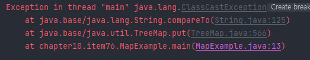

# 💡 아이템 76. 가능한 한 실패 원자적으로 만들라

## ⭕ 실패 원자적(failure-atomic)
* * *
> 호출된 메서드가 실패하더라도 해당 객체는 메서드 호출전 상태를 유지해야 함


## ✅ 메서드를 실패 원자적으로 만드는 방법
* * *
### 1.불변 객체로 설계하는 것
* 불변 객체의 상태는 생성 시점에 고정되어 절대 변하지 않기 때문
* API, 네트워크 프로토콜, 영구 저장용 데이터 포맷 등이 대표적인 예로 완성 후 수정에 한계가 있어 시스템 성능을 제한하지 않는 설계가 필요함

### 2.작업 수행에 앞서 매개변수의 유효성을 검사하는 것
* Stack.pop 메서드의 예시
```java
public Object pop() {
      //매개 변수 유효성 검사
      if (size == 0)
          throw new EmptyStackException();
      Object result = elements[--size];
      elements[size] = null; 
      return result;
}
```

### 2-1.실패할 가능성이 있는 코드를, 객체의 상태를 바꾸는 코드보다 앞에 배치하는 것
* 2번과 비슷한 취지로, 계산 수행 전에는 인수의 요효성을 검사해볼 수 없을 때 사용
* TreeMap의 예시
```java
public class MapExample {
    static Map<Object, String> map = new TreeMap<>();

    public static void main(String[] args) {
        map.put(1, "A");
        map.put(2, "B");
        map.put(3, "C");
        map.put("4", "D"); //ClassCastException
    }
}
```

* ClassCastException 예시


### 3. 객체의 임시 복사본에서 작업을 성공하면 원래 객체와 교환하는 방식
* 데이터를 임시 자료구조에 저장해 작업하는게 더 빠를 때 적용하기 좋은 방식
* 어떤 정렬 메서드에서는 정렬을 수행하기 전에 입력 리스트의 원소들을 배열로 옮겨 닮음
  * 배열을 사용하면 정렬 알고리즘의 반복문에서 원소들에 훨씬 빠르게 접근 가능
  * 정렬에 실패하더라도 입력 리스트는 변하지 않음

```java
default void sort(Comparator<? super E> c) {
    Object[] a = this.toArray();
    Arrays.sort(a, (Comparator) c);
    ListIterator<E> i = this.listIterator();
    for (Object e : a) {
        i.next();
        i.set((E) e);
    }
}
```

```java
public class TempExample {
    public static void main(String[] args) {
        List<Integer> list = new ArrayList<>();
        list.add(1);
        list.add(2);
        list.add(3);
        list.add(4);

        Integer[] array = list.toArray(new Integer[0]);

        // 배열의 값을 변경
        for (int i = 0; i < array.length; i++) {
            array[i] = array[i] + 1;
        }

        // 변경된 배열 출력
        for (int num : array) {
            System.out.println(num);
        }

        // 원래의 리스트는 변하지 않음
        for (int num : list) {
            System.out.println(num);
        }
    }
}
```
### 4. 복구 코드를 작성하여 작업 전 상태로 되롤리는 방법
* 작업 도중 발생하는 실패를 가로채는 복구 코드를 작성
* 주로 (디스크 기반의) 내구성(durability)을 보장해야 하는 자료구조에 쓰이는데, 자주 쓰이는 방법은 아님


## ✅ 실패 원자성은 권장되는 덕목이지만 항상 달성할 수 있는 것은 아님

### 1. 예시
 * 두 스레드가 동기화 없이 같은 객체를 동시에 수정할 경우 객체의 일관성이 깨질 수 있음

### 2. Error는 복구할 수 없으므로 AssertionError에 대해서는 시도조차 필요없음

### 3. 때에 따라 권장되지 않음
* 실패 원자성을 달성하기 위한 비용/복잡도가 아주 큰 연산도 있기 때문
* 메서드 명세에 기술한 예외라면 설혹 예외가 발생하더라도 객체의 상태는 똑같이 유지되어야 한다는 것이 기본 규칙
  * 이 규칙을 지키지 못한다면 실패 시 객체 상태를 API 설명에 명시해야 하지만 상당 API 문서가 잘 지켜지지 않음