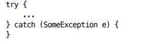

# 💡 아이템 77. 예외를 무시하지 말라

## ✅ 예외를 무시하는 법
* * *
> 메서드 블록을 try문으로 감싼 후 catch 블록에서 아무 일도 하지 않는 것



> catch 블록을 비워두면 예외가 존재할 이유가 없어진다.

## ✅ 예외를 무시해야 할 때
* * *
### 1. 예외를 무시해야 할 때도 있음

* FileInputStream을 닫을 때
  * (입력 전용 스트림이므로) 파일의 상태를 변경하지 않았으니 복구할 것이 없음
  * (스트림을 닫는다는 건) 필요한 정보는 이미 다 읽었다는 뜻이니 남은 작업을 중단할 이유도 없음

### 2. 이유를 주석으로 남기고 예외 변수 이름도 ignored로 바꿔놓는것을 권장
```java
try {
    numColors = f.get(1L, TimeUnit.SECONDS);
} catch (TimeoutException | ExecutionException ignored) {
    //무시한 이유를 적는다.
}
```

## ✅ 정리
* * *
### 비검사와 검사 예외에 똑같이 적용
* 예측할 수 있는 예외 상황이든 프로그래밍 오류든, 빈 catch 블록으로 지나치면 그 프로그램은 오류를 내재한 채 동작하게 됨
* 어느 순간 문제의 원인과 아무 상관없는 곳에서 갑자기 죽어버릴 수 있음

### 예외를 적절히 처리하면 오류를 완전히 피할 수도 있음
* 무시하지 않고 바깥으로 전파되게만 놔둬도 최소한 디버깅 정보를 남긴 채 프로그램이 신속시 중단되게는 할 수 있음


