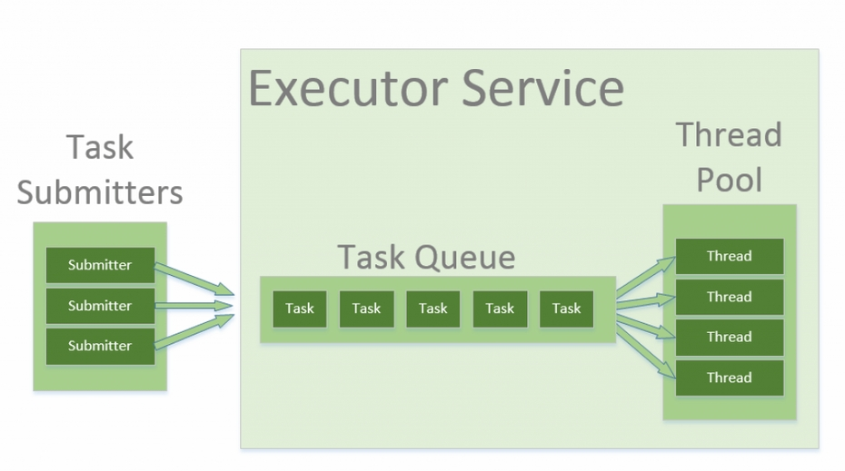

# 💡 스레드보다는 실행자, 태스크, 스트림을 애용하라 

## java.util.concurrent 패키지
java.util.concurrent 패키지에서 인터페이스 기반의 태스크 실행 기능을 제공하는 실행자 프레임워크(Executor Framework)가 있다.   
이를 이용하면 아래와 같이 간단하게 스레드 풀을 이용할 수 있다.

```java
public static void main(String[] args) {
    ExecutorService exec = Executors.newSingleThreadExecutor();
    exec.execute(()-> System.out.println("Hello World!"));
    exec.shutdown();
}
```
### 실행자 서비스의 주요 기능
- 특정 태스크가 완료되기를 기다린다. 코드 79-2의 get 메서드
- 태스크 모음 중 하무것 하나(invokeAny 메서드) 혹은 모든 태스크(invokeAll 메서드)가 완료되기를 기다린다.
- 실행자 서비스가 종료하기를 기다린다(awaitTermination 메서드).
- 완료된 태스크들의 결과를 차례로 받는다(ExecutorCompletionService 이용).
- 태스크를 특정 시간에 혹은 주기적으로 실행하게 한다(ScheduledThreadPoolExecutor 이용).

### 스레드 풀(Thread Pool)
스레드 제어 문제를 해결할 방법으로 스레드 풀을 사용한다.    
매번 생성 및 수거 요청에 처리하는 것이 아닌, 설정해둔 개수만큼 미리 생성해두는 것이다.   
스레드 풀의 스레드 개수는 고정할 수도 있고 필요에 따라 늘어나거나 줄어들게 설정할 수 있다.   
우리가 필요한 실행자 대부분은 `java.util.concurrent.Executors의 정적 팩토리`들을 이용해 생성할 수 있다.


> 태스크를 수행하는 일반적인 케커니즘이 실행자 서비스다. 태스크 수행을 실행자 서비스에 맡기면   
> 원하는 태스크 수행 정책을 선택할 수 있고, 언제든 변경할 수 있다.   
> 핵심은 실행자 프레임워크가 작업 수행을 담당해주는 것이다.

평범하지 않은 실행자를 원한다면 ThreadPoolExecutor 클래스를 직접 사용하면 된다.   
이 클래스는 스레드 풀 동작을 결정하는 거의 모든 속성을 제어할 수 있다.

### Executors.newCachedThreadPool
일반적으로 작은 프로그램이나 가벼운 서버에 적합하다. CachedThreadPool에서는 요청받은 태스크들이 큐에 쌓이지 않고   
즉시 스레드에 위임돼 실행된다. 가용한 스레드가 없다면 새로 하나를 생성한다.   

서버가 아주 무겁다면 CPU 이용률이 100%로 치닫고 새로운 태스크가 도착하는 족족 또 다른 스레드를 생성하며 상황을 악화시킬 수 있다.   
따라서 무거운 프로덕션 서버에서는 `스레드 개수를 고정한 Executors.newFixedThreadPool`을 선택하거나   
완전히 `통제할 수 있는 ThreadPoolExecutor`를 직접 사용하는 편이 낫다.

### 포크-조인(fork-join)
자바7부터 실행자 프레임워크는 포크-조인(fork-join) 태스크를 지원하도록 확장되었다.
ForkJoinTask의 인스턴스는 작은 하위 태스크로 나뉠 수 있고, ForkJoinPool을 구성하는 스레드들이 이 태스크들을 처리하며,    
일을 먼저 끝낸 스레드는 다른 스레드의 남은 태스크를 가져와 대신 처리할 수도 있다.   
이렇게 하면 CPU를 최대한 활용하면서 높은 처리량과 낮은 지연시간을 달성할 수 있다.   
포크-조인 풀을 이용해 만든 병렬 스트림(아이템 48)을 이용하면 이점을 얻을 수 있다.