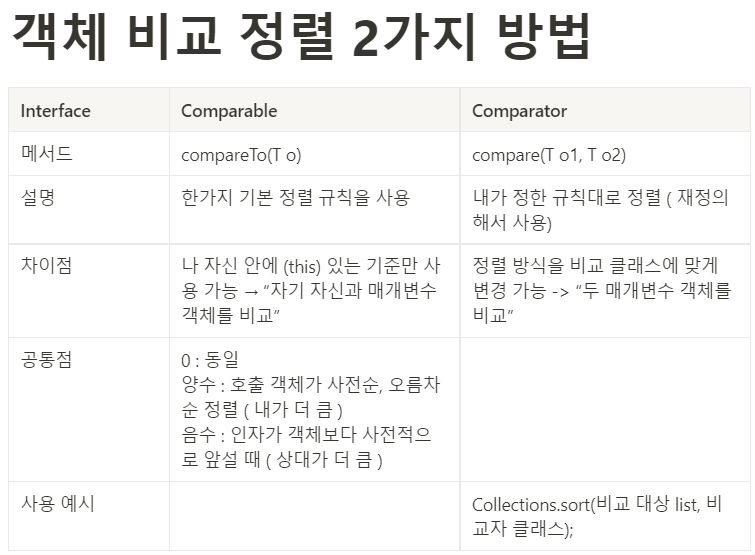

# 💡 Comparable을 구현할지 고려하라
### Comparable의 강점
- Comparable 인터페이스의 유일한 compareTo 메서드는 단순 동치성 비교에 더해 순서를 비교할 수 있으며 제네릭하다.
```java
public int compareTo(T o);
```
- Comparable을 구현했다는 것은 자연적인 순서(natural order)가 있음을 뜻하며 손쉽게 정렬할 수 있다.
- 알파벳, 숫자, 연대 같이 순서가 명확한 값 클래스를 작성한다면 Comparable 인터페이스를 구현하여   
이 인터페이스를 활용하는 수많은 제네릭 알고리즘과 컬렉션의 힘을 누릴 수 있다. (자바 플랫폼 라이브러리의 모든 값 클래스와 열거 타입이 Comparable을 구현했음)

### compareTo 메서드의 일반 규약
> 주어진 객체와 순서를 비교한다. 주어진 객체보다 작으면 음의 정수, 같으면 0, 크면 양의 정수를 반환한다.   
> 이 객체와 비교할 수 없는 타입의 객체가 주어지면 ClassCastException을 던진다.
> 다음 설명에서 sgn(표현식) 표기는 수학에서 부호 함수를 뜻하며, 표현식의 값이 음수면 -1, 0이면 0, 양수면 1을 반환하도록 정의했다.
1. 대칭성
   - 모든 x,y에 대해 sgn(x.compareTo(y)) == -sgn(y.compareTo(x))여야한다.
   - 첫 번째가 두 번째보다 작았다면 두 객체 참조의 순서를 바꿔 비교했을 때 두 번째가 첫 번째보다 커야한다.
   - x.compareTo(y)가 예외를 던지면, y.compareTo(x)도 예외를 던져야한다.
2. 추이성
   - x.compareTo(y) > 0 && y.compareTo(z) > 0 이면 x.compareTo(z) > 0 이여야 한다.
   - x가 y보다 크고 y가 z보다 크면 x는 z보다 크다.
3. 반사성
   - 모든 z에 대해 x.compareTo(y) == 0이면 sgn(x.compareTo(z)) == sgn(y.compareTo(z))이다.
4. 동치성
   - 필수는 아니지만 꼭 지키길 권장한다. (x.compareTo(y) == 0) == (x.equals(y))여야 한다.   
     Compareable을 구현하고 이 권고를 지키지 않는 모든 클래스는 그 사실을 명시해야 한다.
   
### compareTo와 equals의 일관성이 지켜지지 않은 BigDecimal 클래스 예
```java
public class SetTest {
    public static void main(String[] args) {
        final BigDecimal bigDecimal1 = new BigDecimal("1.0");
        final BigDecimal bigDecimal2 = new BigDecimal("1.00");

        final HashSet<BigDecimal> hashSet = new HashSet<>();
        hashSet.add(bigDecimal1);
        hashSet.add(bigDecimal2);

        System.out.println(hashSet.size());

        final TreeSet<BigDecimal> treeSet = new TreeSet<>();
        treeSet.add(bigDecimal1);
        treeSet.add(bigDecimal2);

        System.out.println(treeSet.size());
    }
}
```
```
실행 결과
hashSet : 2
treeSet : 1
```
> hashSet과 TressSet은 서로 다른 동치성을 사용한다.   
> HashSet은 equals 기반으로 비교하기 때문에 다른 값으로 인식하여 크가가 2가 되고   
> TressSet은 compareTo를 기반으로 동치성을 비교하기 때문에 같은 값으로 인식하여 크기가 1이 된다.

### compareTo 메서드 구현
- 관계 연산자 <와 > 는 오류를 유발할 수 있으니 박싱된 기본 타입 클래스의 정적 메서드인 compare를 이용하면 된다.
```java
@Override
public int compareTo (Student o) {
    return Integer.compare(this.age, o.age);
}
```
- 기본 타입 필드가 여럿일 때 가장 핵심 필드부터 비교해간다.
```java
public int compareTo(PhoneNumber pn) {
	int result = Short.compare(this.areaCode, pn.areaCode); // 가장 중요한 필드
	if(result == 0) {
		result = Short.compare(this.prefix, pn.prefix);
		if(result == 0) {
			result = Short.compare(this.lineNum, pn.lineNum);
		}
	}
    return result;
}
```
- 비교자(Comparator) 생성 메서드를 활용하면 메서드 연쇄 방식으로 비교자를 생성할 수 있어서 가독성이 높아진다. 다만 성능의 저하가 있다.
```java
// 나이가 많을 수록 우선순위가 높고 앞 반일 수록 순서가 높음
private static final Comparator<Student> StudentComparator =
        Comparator.comparingInt((Student st) -> st.age)
        .thenComparingInt(st -> -st.classNumber);

public int compareTo(Student o){
    return StudentComparator.compare(this,o);
}
```
> thenComparingInt(ToIntFunction<? super T> keyExtractor)   
> 두 객체의 값이 같다면 두 번째 기준으로 비교한다.
> keyExtractor는 객체의 특정 필드 또는 특정 메서드를 통해 정수 값을 추출하는 ToIntFunction 함수형 인터페이스

### Comparable과 Comparator 비교
