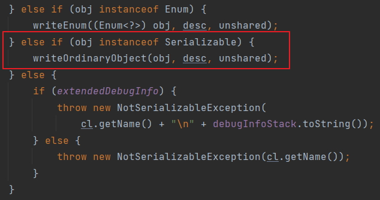

# 💡 정의하려는 것이 타입이라면 마커 인터페이스를 사용하라

## ✔마커 인터페이스(Mark Interface)란?
인터페이스 내부에 상수도 메서드도 없는 인터페이스를 말한다.   
아무 내용이 없어서 쓸모가 없어 보이지만 마커 인터페이스는 객체의 타입과 관련된 정보를 제공함으로써   
컴파일러와 JVM이 객체에 대한 추가적인 정보를 얻을 수 있다.   
마커 인터페이스의 대표적인 예로 Cloneable, Serializable 인터페이스가 있다.
```java
public interface Serializable {
}
```
> Serializable 인터페이스는 자신을 구현한 클래스의 인스턴스는 `ObjectOutputStream을 통해 쓸(wirte)` 수 있다고, 
> 즉 직렬화할 수 있다고 알려준다.

###  마커 인터페이스 활용 예시
```java
public class MakerInterfaceTest {
    public static void main(String[] args) {
        File f = new File("test.txt");
        try{
            ObjectOutputStream objOutputStream = new ObjectOutputStream(new FileOutputStream(f));

            // 객체 직렬화 및 출력
            objOutputStream.writeObject(new SomeObject("yoon", "yoon@naver.com"));

            objOutputStream.close();

            System.out.println("객체가 성공적으로 직렬화되었습니다.");
        } catch (Exception e){
            e.printStackTrace();
        }
    }
}

public class SomeObject {
    private String name;
    private String email;
    // 생략

    /*
    java.io.NotSerializableException: chapter6.item41.MakerInterfaceTest$SomeObject
    at java.base/java.io.ObjectOutputStream.writeObject0(ObjectOutputStream.java:1175)
     */
```
> 코드 실행 시, NotSerializableException이 발생하며 직렬화가 불가능하다.   
> 그 이유는 writeObject0 에서 obj가 Serializable의 인스턴스인지를 체크하고 코드를 진행시키고 있다.   
> 이러한 방식을 통해 아무 내용이 없는 마커 인터페이스가 객체에 추가적인 정보를 주입시킬 수 있다.   
> 
> 

## ✔ 마커 인터페이스와 마커 애너테이션 비교
### 마커 인터페이스의 장점
1) 마커 인터페이스를 구현한 클래스의 인스턴스들을 구분하는 타입으로 쓸 수 있지만 마커 애너테이션은 그렇지 않다.
- 타입이기 때문에 컴파일 타임에 오류를 알 수 있지만 마커 애너테이션을 사용했다면 런타임에 발견할 것이다.
- 자바의 직렬화는 `Serializable`의 마커 인터페이스를 보고 그 대상이 직렬화할 수 있는 타입인지 확인한다.
- 마커 인터페이스를 사용하는 주요 이유는 컴파일 타임 오류 검출이다.
2) 마커 인터페이스는 적용 대상을 더 정밀하게 지정할 수 있다.
- `적용 대상(@Target)을 ElementType.TYPE`으로 선언한 애너테이션은 모든 타입(클래스, 인터페이스, 열거 타입, 애너테이션)에 달 수 있어서 타입을 더 세밀하게 제한하지 못한다.
- 마커 인터페이스는 마킹하는 클래스에만 그 인터페이스를 구현하면 된다. 그러면 자동으로 하위 타입임을 보장하는 것이다.

### 마커 애너테이션의 장점
1) 거대한 애너테이션 시스템의 지원을 받는다.
- 애너테이션 처리기(컴파일 타임에 애너테이션 분석 및 처리), 리플렉션(실행 시점에 클래스의 정보를 검사 및 조작), 애너테이션 메타데이터 저장 및 검색 기능 등이 있다.
- 애너테이션을 적극 활용하는 프레임워크에서는 마커 애너테이션을 쓰는 쪽이 일관성을 지키는 데 유리하다.

|       |마커 인터페이스|마커 애너테이션|
|:-----:|:-----------:|:-----------:|
|사용 방법|인터페이스로 정의하고 해당 인터페이스를 구현하는 클래스를 마킹|애너테이션으로 정의하고 애너테이션을 클래스나 필드에 적용|
|확장성|인터페이스를 구현하므로 다중 상속 불가능|여러 개의 애너테이션을 조합하여 사용 가능|
|코드 가독성|인터페이스의 이름이 의도를 명확히 드러냄|애너테이션의 이름과 설정 값에 의존|
|실행 시점|컴파일 타임에 검사 가능|런타임에 검사 가능|

## ✔ 마커 인터페이스 vs 마커 애너테이션, 언제 사용해야 할까?
- 클래스와 인터페이스 외의 프로그램 요소(모듈, 패키지, 필드, 지역변수 등)에 마킹해야 할 때 애너테이션을 쓸 수 밖에 없다.
- 클래스나 인터페이스에 적용한다면 `마킹된 객체를 매개변수로 받는 메서드`를 작성할 경우가 있다면 마커 인터페이스를 쓰자.   
그러면 마커 인터페이스를 메서드의 매개변수 타입으로 사용하여 컴파일 타임에 오류를 잡아낼 수 있다.

### 💡마무리
> 마커 인터페이스와 마커 애너테이션은 각자의 쓰임이 있다.   
> 적용 대상이 ElementType.TYPE인 마커 애너테이션만 작성하고 있다면, 마커 인터페이스가 낫지는 않을지 생각해보자.