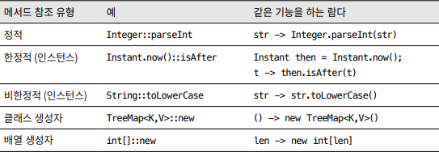

# 💡 람다보다는 메서드 참조를 사용하라

## 1. 메서드 참조 (method reference)
- 함수 객체를 람다보다도 간결하게 만들 수 있다.
- 자바 8 때 Map에 추가된 merge 메서드를 사용한 예제

```java
//임의의 키와 Integer 값의 매핑을 관리하는 프로그램의 일부다. 

public class Merge {
    public static void main(String[] args) {
        Map<String, Integer> map = new HashMap<>();

        //키가 맵 안에 없다면 키와 숫자 1을 매핑하고, 이미 있다면 기존 매핑 값을 증가시킨다.
        map.merge("key1", 1, (count, incr) -> count + incr);
        map.merge("key2", 1, (count, incr) -> count + incr);

        //자바 8이 되면서 기본 타입의 박싱 타입은 이 람다와 기능이 같은 정적 메서드 sum을 제공하기 시작했다.
        map.merge("key1", 1, Integer::sum);

        System.out.println(map);
    }
}

```

## 2. 람다와 메서드 참조
### (1) 차이점
- 매개변수 수가 늘어날수록 메서드 참조로 제거할 수 있는 코드양도 늘어난다.
- 하지만 어떤 람다에서는 매개변수의 이름 자체가 메서드 참조보다 읽기 쉽고 유지보수도 쉬울 수 있다.

* 람다가 메서드 참조보다 간결할 때가 있다. 주로 메서드와 람다가 같은 클래스에 있을 때 그렇다.
```java
public class GoshThisClassNameIsHumongous {
    public static void action() {
        System.out.println("GoshThisClassNameIsHumongous.action");
    }

    public static void main(String[] args) {
        ExecutorService service = Executors.newSingleThreadExecutor();
        service.execute(GoshThisClassNameIsHumongous::action);

        //람다로 바꿀 시 더 간결해진다.
        service.execute(()-> action());
    }
}
```
### (2) 공통점
* 람다로 할 수 없는 일이라면 메서드 참조로도 할 수 없다.
* 유일한 예외가 존재한다(제네릭 함수 타입 구현)
```java
interface G1 {
    <E extends Exception> Object m() throws E;
}

interface G2 {
    <F extends Exception> String m() throws Exception;
}

interface G extends G1, G2 {
}
```
* 함수형 인터페이스 G를 함수 타입으로 표현하면 다음과 같다.
```java
<F extends Exception> () -> String throws F
```


## 3. 메서드 참조의 유형
- 위의 예시들이 정적 메서드를 가리키는 메서드 참조
- 각각의 생성자들을 가리키는 클래스, 배열 생성자 메서드 참조가 있다.
- 인스턴스 메서드를 참조하는 유형
  - 한정적 인스턴스 메서드 참조 (수신 객체를 특정)
    - 함수 객체가 받는 인수와 참조되는 메서드가 받는 인수가 똑같다.
  - 비한정적 인스턴스 메서드 참조 (수신 객체를 특정하지 않음)
    - 함수 객체를 적용하는 시점에 수신 객체를 알려준다.
   
