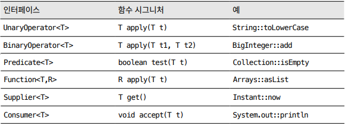

# 💡 표준 함수형 인터페이스를 사용하라


## 1. 함수 객체를 매개변수로 사용하는 예시
* LinkedHashMap의 protected 메서드인 removeEldestEntry를 재정의하면 캐시로 사용할 수 있다.
  * 맵에 새로운 키를 추가하는 put 메서드는 이 메서드를 호출하여 true가 반환되면 맵에서 가장 오래된 원소를 제거한다.
```java
//맵에 가장 최근 원소 100개를 유지한다.
protected boolean removeEldestEntry(Map.Entry<K,V> eldest) {
        return size() > 100;
        }
```
* LinkedHashMap을 오늘날 다시 구현한다면, 함수 객체를 받는 정적 팩터리나 생성자를 제공했을 것이다.
* 이 인터페이스는 자바 표준 라이브러리에 이미 같은 모양의 인터페이스가 있기에 굳이 사용할 이유가 없다.
```java
// 불필요한 함수형 인터페이스 - 대신 표준 함수형 인터페이스를 사용하라.  
FunctionalInterface interface EldestEntryRemovalFunction<K,V> { 
    boolean remove( Map<K,V> map, Map.Entry<K,V> eldest ); 
}
```
- LinkedHashMap 예에서는 직접 만든 EledestEntryRemoveFuntion 대신 표준 인터페이스인 BiPredicate<Map<K, V>>, Map.Entry<K, V>를 사용할 수 있다.


## 2. 표준 함수형 인터페이스
- java.util.function 패키지를 보면 다양한 용도의 표준 함수형 인터페이스가 담겨 있다.
- 필요한 용도에 맞는 게 있다면, 직접 구현하지 말고 표준 함수형 인터페이스를 활용하자.
- 장점
  - 유용한 디폴트 메서드를 많이 제공하여 다른 코드와의 상호운용성도 크게 좋아진다.
  - ex) Predicate 인터페이스는 프레디케이트(predicate)들을 조합하는 메서드를 제공한다.
```java
@FunctionalInterface
public interface Predicate<T> {

  default Predicate<T> and(Predicate<? super T> other) {
    Objects.requireNonNull(other);
    return (t) -> test(t) && other.test(t);
  }

  default Predicate<T> negate() {
    return (t) -> !test(t);
  }

  default Predicate<T> or(Predicate<? super T> other) {
    Objects.requireNonNull(other);
    return (t) -> test(t) || other.test(t);
  }

  static <T> Predicate<T> isEqual(Object targetRef) {
    return (null == targetRef)
            ? Objects::isNull
            : object -> targetRef.equals(object);
  }
}
```
  
### (1) 기본 인터페이스
boolean test(T t);
- java.util.function 패키지에는 총 43개의 인터페이스가 담겨 있고 기본 6개만 기억하면 나머지를 유추할 수 있다.
- 

- Operator : 인수가 1개인 UnaryOperator와 2개인 BinaryOperator로 나뉘며, 반환값과 인수의 타입이 같은 함수를 뜻한다.
- Predicate : 인수 하나를 받아 boolean을 반환하는 함수를 뜻한다.
- Function : 인수와 반환 타입이 다른 함수를 뜻한다.
- Supplier : 인수를 받지 않고 값을 반환(혹은 제공)하는 함수를 뜻한다.
- Consumer : 인수를 하나 받고 반환값은 없는(특히 인수를 소비하는) 함수를 뜻한다.

### (2) 기본 인터페이스의 변형
- 기본 인터페이스는 기본 타입인 int, long, double용으로 각 3개씩 변형이 생긴다.
  - 이름은 기본 인터페이스의 이름 앞에 해당 기본 타입 이름을 붙여 지었다.
  - ex) int를 받는 Predicate는 IntPredicate, long을 받아 long을 반환하는 BinaryOperator는 LongBinaryOperator가 되는 식이다.

- Function의 변형은 유일하게 반환 타입이 매개변수화된다.
  - ex) LongFunction<int[]>은 long 인수를 받아 int[]를 반환한다.
- Function 인터페이스에는 기본 타입을 반환하는 변형이 총 9개 더 있다.
  - 입력과 결과 타입이 모두 기본 타입이면 접두어로 SrcToResult를 사용한다(총 6개)
  - LongToIntFunction이 되는 식이다.

- 기본 함수형 인터페이스 중 3개에는 인수를 2개씩 받는 변형이 있다(총 6개).
  - BiPredicate<T, U>, BiFunction<T,U,R>, BiConsumer<T,U>
  - BiFunction은 기본 타입을 반환하는 세 변형 ToIntBiFunction<T,U>, ToLongBiFunction<T,U>, ToDoubleBiFunction<T,U>가 존재한다.

- Consumer에는 객체 참조와 기본 타입 하나, 즉 인수를 2개 받는 변형이 존재한다.
  - ObjDoubleConsumer<T>, ObjIntConsumer<T>, ObjLongConsumer<T>.

- BooleanSupplier 인터페이스는 boolean을 반환하도록 한 Supplier의 변형이다.
  - 이것은 표준 함수형 인터페이스 중 boolean을 이름에 명시한 유일한 인터페이스다.
  - 하지만 Predicate와 그 변형 4개도 boolean 값을 반환할 수 있다.
  
### (3) 주의점
- 표준 함수형 인터페이스 대부분은 기본 타입만 지원한다. 하지만 여기에 박싱된 기본 타입을 넣어 사용하지는 말자.
  - 계산량이 많을 떄 성능이 처참히 느려질 수 있다.
 ```java
import java.util.Arrays;
import java.util.List;
import java.util.function.Consumer;

public class FunctionalInterfaceExample {
    public static void main(String[] args) {
        List<Integer> numbers = Arrays.asList(1, 2, 3, 4, 5);
        
        // Consumer 인터페이스를 사용하여 정수를 출력하는 메서드를 구현
        IntConsumer printNumber = (int number) -> System.out.println(number);
        // 여기에 박싱된 기본 타입을 넣어 사용하지는 말자
        Consumer<Integer> printNumber = (Integer number) -> System.out.println(number);
    
    }
}
```
## 3. 전용 함수형 인터페이스 직접 작성해야 할 때

### (1) 함수형 인터페이스를 직접 만들어야 할 경우
- 표준 인터페이스 중 필요한 용도에 맞는 게 없다면 직접 작성해야 한다.
  - ex) 매개변수 3개를 받는 Predicate가 필요하다.
### (2) 직접 만든 함수형 인터페이스에는 항상 @FunctionalInterface 애너테이션을 사용하자
- 해당 인터페이스가 함수형 인터페이스라는것을 명시
- 추상 메서드를 2개 이상 작성하면 컴파일 오류
```java
@FunctionalInterface
public interface TestInterface {

  void test();
  void test2(); //컴파일 오류
}

```

## 4. 서로 다른 함수형 인터페이스를 같은 위치의 인수로 받는 메서드들을 다중 정의해서는 안된다.
- 클라이언트에게 불필요한 모호함만 안겨준다.
- 그래서 올바른 메서드를 알려주기 위해 형변환해야 할 때가 자주 생긴다(아이템 52).
```java
//  <T> Future<T> submit(Callable<T> task);
//  Future<?> submit(Runnable task);


// ExecutorService의 submit 메서드는 Callable<T>를 받는 것과 Runnable을 받는 것을 다중정의했다.
public class ExecutorServiceExample {
  public static void main(String[] args) {
    ExecutorService executorService = Executors.newSingleThreadExecutor();

    // Callable을 사용한 submit
    executorService.submit((Callable<String>) () -> {
      return null;
    });

    // Runnable을 사용한 submit
    executorService.submit((Runnable)() -> {
    });

  }
}
```