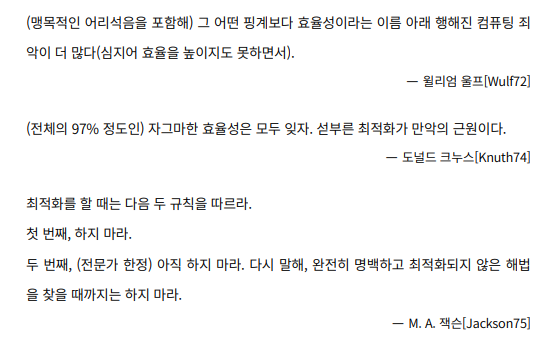

# 💡 아이템 67. 최적화는 신중히 하라

## ⭕ 최적화란
* * *
> 애플리케이션의 성능을 향상시키는 과정
* 메모리 관리(객체 생성/소멸 관리) 
* 다중 스레드 최적화동기화(synchronization)와 락(locking)

> 성능 개선을 하려다 전체 구조를 해칠 수 있음

> 최적화 보단 초기 API설계에 집중하라


## ⭕ 최적화의 관한 격언
* * *


## ✅ 설계단계에서는 신중히 진행해라
* * *
> 매우 빠른 프로그램보다는 좋은(안전한) 프로그램을 작성하라
* 구현상의 이슈는 추후 프로그램 완성에 해결 가능
* 아키텍처의 결함이 문제가 있다면 시스템 전체를 수정해야 함

### 1.성능을 제한하는 설계는 피하라
* 완성 후 변경하기 가장 어려운 설계 오소가 컴포넌트 간 혹은 외부 시스템과의 소통 방식
* API, 네트워크 프로토콜, 영구 저장용 데이터 포맷 등이 대표적인 예로 완성 후 수정에 한계가 있어 시스템 성능을 제한하지 않는 설계가 필요하다.

### 2.API를 설계할 때 성능에 주는 영향을 고려하라
* public 타입을 가변으로 만들면, 불필요한 방어적 복사를 유발할 수 있음
```java
  public abstract class Component implements ImageObserver, MenuContainer,Serializable {
  public Dimension getSize() {
      return size();
  }
  
  @Deprecated
  public Dimension size() {
    return new Dimension(width, height); // 방어적 복사
  }
  
//  만약 다르게 설계했다면?
//   1. Dimension 불변으로 만들기
//   2. getSize 말고, getWidth, getHeight
//   - 이 방법은 추후 추가되었으나, 기존 클라이언트 코드에서는 감수해야함
  public int getWidth() {
    return width;
  }


  public int getHeight() {
    return height;
  }
}
```

```java
public class Dimension extends Dimension2D
        implements java.io.Serializable {  // 불변이 아님

  public int width;
  public int height;

  public void setSize(int width, int height) {
    this.width = width;
    this.height = height;
  }
}
```

* 인터페이스가 있는데 굳이 구현 타입을 사용하는것 역시 좋지 않다.
```java
public class Example {

  Map<String, String> map = new HashMap<>();

  //HashMap에 종속적
  HashMap<String, String> hashMap = new HashMap<>();
}

```

### 3. 성능을 위해 API를 왜곡하지 마라
* 잘 설계되어 있는 API는 성능도 대체적으로 좋으며, 성능 문제가 있다면 추후 버전에서 사라질 수 있음 
* 왜곡한 API는 계속해서 관리 해줘야함. 수정된 API에 대한 오류 체크 및 문서화 등등
* 일시적으로 성능 향상이 있을 수 있으나, 추후 성능향상이 사라짐에도 위의 작업을 수행해야함

### 4. 각각의 최적화 시도 전후로 성능을 축정하라
* 최적화 기법을 적용해도 크게 변하지 않고 더 나빠질 수 있음
* 프로그램에서 정확하게 원인이 되는 부분을 찾기 어렵기 때문
* jmh과 같은 프로파일링 도구를 사용하라
  * 개별 메서드의 소비 시간과 호출 횟수 같은 런타임 정보를 제공