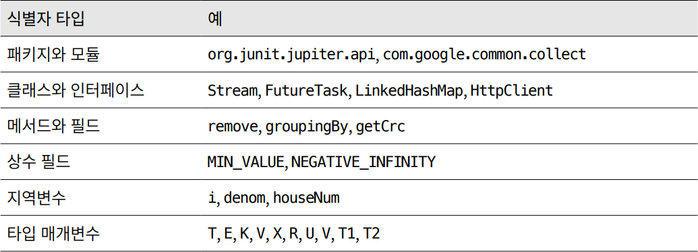

# 💡 아이템 68. 일반적으로 통용되는 명명 규칙을 따르라

## ⭕ 자바의 명명 규칙
* * *

> 크게 철자와 문법, 두 범주로 나뉨

## ⭕ 철자 규칙
* * *
> 패키지, 클래스, 인터페이스, 메서드, 필드, 타입 변수의 이름을 다룸
### ✅ 패키지와 모듈 이름
* 각 요소를 점(.)으로 구분하여 계층적으로 지음
* 모두 소문자 알파벳 혹은 (드물게) 숫자
* 예외적으로 표준 라이브러리와 선택적 패키지들은 java, javax로 시작
* 각 패키지 이름은 utilities보다는 util같은 약어를 추천

### ✅ 클래스와 인터페이스의 이름 (열거타입, 애너테이션 포함)
* 하나 이상의단어로 이뤄지며, 대문자로 시작한다 (List, Map등)
* 여러 단어의 첫 글자만 딴 약자나 max, min 처럼 널리 통용되는 줄임말을 제외하고 단어를 줄여 쓰면 안됨

### ✅ 메서드와 필드
* 첫 글자를 소문자로 쓴다는 점만 빼면 클래스 명명 규칙과 같음
* 만약 첫 단어가 약자라면, 단어 전체가 소문자여야 함
* 
### ✅ 상수 필드
* 예외적으로 모두 대문자로 쓰며 단어 사이는 밑줄로 구분
```java
private static final int DEFAULT_INITIAL_CAPACITY = 16;
```
### ✅ 지역변수
* 멤버와 비슷한 명명 규칙이 적용 됨
* 단, 약어를 사용해도 좋다 (i, idx)
### ✅ 타입 매개변수 이름
* 보통 한 문자로 표현함.
  * T : 임의의 타입
  * E : 컬렉션 원소의 타입
  * K, V: 맵의 키와 값
  * X : 예외
  * R : 메서드 반환 타입
  * T, U, V (T1, T2, T3) : 임의 타입의 시퀀스
  * 
## ⭕ 문법 규칙
* * *
> 철차규칙에 비해 더 유연하고 논란도 많음
> 
### ✅ 클래스 (열거 타입 포함)
* 보통 단수 명사나 명사구를 사용(Thread, PriorityQueue 등)
* 객체를 생성할 수 없는 클래스는 보통 복수형으로 지음 (Collectors, Collections 등)

### ✅ 인터페이스
* 클래스와 똑같이 짓거나, able이나 ible로 끝나는 형용사로 지음(Runnable, Accessible 등)

### ✅ 애너테이션
* 워낙 다양하게 활용되어 규칙 없이 명사, 동사, 전치사, 형용사가 두루 쓰임(Singleton, Inject 등)

### ✅ 메서드
* 동사나, 동사구로 지음 (append, drawImage)
* boolean 메서드라면 보통  is, has로 시작하고 명사, 형용사 단어로 지음(isEmpty 등)
* 인스턴스의 속성을 반환할때는 보통 명사(구)나 get+동사구 (size, getTime 등)

### ✅ 특별한 케이스
* 객체의 타입을 바꿔서 다른 타입의 다른 객체를 반환하는 인스턴스 메서드는 to + 타입 (toString, toArray 등)
* 객체의 내용을 다른 뷰로 보여주는 메서드는 as + 타입 (asList)
* 객체의 값을 기본 타입 값으로 반환하는 메서드는 타입 + Value (intValue)
* 정적 팩터리 이름 (아이템 1장 참고)
  * from, of, valueOf, instance, getInstance, newInstance, getType, newType을 흔히 사용

### ✅ 필드 이름
* boolean 탕비의 필드 이름은 보통 boolean 접근자 메서드에서 앞 단어를 뺀 형태 (initialized, composite 등)
* 다른 타입의 필드라면 명사나, 명사구를 사용 (height, bodyStyle 등)